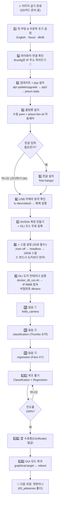

# 🎓 젯슨나노 2GB — NVIDIA DLI 수료증 받기 전체 가이드

> **"Getting Started with AI on Jetson Nano"** 과정을 처음부터 끝까지,
> 아무것도 모르는 학생도 천천히 따라 하면 수료증(Certificate)을 받을 수 있도록 순서대로 정리한 가이드입니다.
>
> **전제 조건** : SD 카드에 JetPack 이미지 굽기(포맷 + balena Etcher)는 이미 끝난 상태에서 시작합니다.
> 이미지 굽기가 아직이라면 👉 [1_jetsonNanoStart.md](./1_jetsonNanoStart.md) 를 먼저 보세요.

---

## 전체 로드맵 (한눈에 보기)

| 단계 | 할 일 | 소요시간(대략) |
|---|---|---|
| 1 | 첫 부팅 & 우분투 초기 설정 | 20분 |
| 2 | 와이파이 연결, 터미널 기초 익히기 | 20분 |
| 3 | 시스템 업데이트 + jtop(모니터링 도구) 설치 | 30분 |
| 4 | 쿨링팬 설치와 온도 관리 | 20분 |
| 5 | (선택) 한글 입력기 설치 | 20분 |
| 6 | 카메라 연결 확인 & 사진/영상 찍어보기 | 30분 |
| 7 | NVIDIA 계정 만들기 & DLI 코스 등록 | 15분 |
| 8 | ⭐ 메모리 스왑 설정 (2GB는 필수!) | 20분 |
| 9 | DLI 도커 컨테이너 실행 & JupyterLab 접속 | 30분~1시간 |
| 10 | 실습 : Hello Camera → Classification → Regression | 2~4시간 |
| 11 | 퀴즈 풀기 | 30분 |
| 12 | 🏆 수료증 받기 | 5분 |
| 13 | GUI 모드 복귀 & 마무리 | 10분 |

### 순서도 (Flowchart)



---

## 1단계. 첫 부팅 & 우분투 초기 설정

이미지가 구워진 마이크로 SD 카드로 젯슨나노를 처음 켜는 단계입니다.

### 1-1. 연결 순서 (⚠️ 파워는 항상 마지막!)

1. 마이크로 SD 카드를 젯슨나노 슬롯에 넣기
   - 가볍게 넣고 살짝 눌러주면 "톡" 하고 고정됩니다.
   - 뺄 때도 살짝 눌러서 튀어나오면 빼세요. **절대 억지로 빼지 않기.**
2. HDMI 선을 모니터에 연결
3. 와이파이 동글 확인 (USB 포트)
4. 무선 키보드/마우스 동글 확인 (USB 포트)
5. **마지막으로 파워선 연결** → 자동으로 부팅됩니다.

### 1-2. 우분투 초기 설정 마법사

부팅되면 초록색 NVIDIA 화면 후 설정 화면이 나옵니다. 순서대로:

1. 라이선스 동의 → **Continue**
2. 언어 : **English** 선택 (⚠️ 한국어 말고 English! 나중에 오류가 적습니다)
3. 키보드 : English (US)
4. 와이파이 선택 후 인터넷 비밀번호 입력
5. 시간대 : 지도를 클릭해서 **Seoul** 이 나오게 합니다
6. 사용자 계정 만들기 — 교육 통일 계정:
   - **Your name : `dli`**
   - **Password : `dli`**
7. APP 파티션 크기는 기본값(최대) 그대로 → Continue
8. 절차가 끝나면 자동으로 **reboot** 되고 멋진 녹색 바탕화면이 나옵니다. 준비 끝! 🎉

---

## 2단계. 와이파이 연결 확인 & 리눅스 기초 익히기

### 2-1. 화면 둘러보기

- 젯슨나노는 100mm×80mm 크기의 초소형 컴퓨터입니다. (GPU 128코어 Maxwell / 쿼드코어 ARM A57 / 램 2GB)
- 우리가 보고 있는 이 화면이 리눅스(우분투)의 **GUI**(Graphical User Interface)입니다.
- 왼쪽 툴바에서 **Files**(파일 탐색기), **Terminal**(터미널)을 찾아보세요.

### 2-2. 터미널 열고 IP 주소 확인

터미널을 열고(`Ctrl+Alt+T`) 다음을 입력합니다:

```bash
ifconfig
```

- `wlan0` 항목의 `inet` 뒤 숫자(예: `192.168.0.204`)가 내 젯슨나노의 **IP 주소**입니다.
- **이 주소는 9단계에서 꼭 필요하니 스크린샷을 찍거나 적어두세요!**

---

## 3단계. 시스템 업데이트 + jtop 설치

`jtop`은 젯슨나노의 온도·메모리·GPU 상태를 한눈에 보는 **시스템 모니터링 도구**입니다.

터미널에서 한 줄씩 입력합니다:

```bash
sudo apt-get update
sudo apt-get upgrade
```

> `update`는 소프트웨어 목록을 최신으로 받아오고, `upgrade`는 실제 설치된 패키지를 업데이트합니다.
> 비밀번호를 물어보면 `dli` 입력 (입력해도 화면에 안 보이는 게 정상입니다!)
> `Do you want to continue? [Y/n]` 이 나오면 **Y** 입력.

파이썬 패키지 관리자(pip)와 jetson-stats 설치:

```bash
sudo apt install python3-pip
sudo -H pip3 install -U jetson-stats
```

설치 확인 후 재부팅하고 실행:

```bash
pip3 list | grep jetson    # jetson-stats 가 보이면 성공
sudo reboot
```

재부팅 후 터미널에서:

```bash
jtop
```

- CPU/GPU 사용량, 메모리, **온도(temperature)** 를 확인해보세요. (종료는 `q`)
- 온도가 47℃를 넘어가는 경우도 있습니다 → 다음 단계에서 쿨링팬을 답니다.

---

## 4단계. 쿨링팬 설치와 온도 관리

### 4-1. 쿨링팬 장착 후 수동으로 돌려보기

```bash
sudo sh -c 'echo 128 > /sys/devices/pwm-fan/target_pwm'
```

- 다시 `jtop`으로 온도를 확인해보세요. **약 10도 정도 떨어지기도 합니다.**
- 팬 끄기: `sudo sh -c 'echo 0 > /sys/devices/pwm-fan/target_pwm'`

### 4-2. 자동 팬 컨트롤 설치 (온도에 따라 자동 조절)

```bash
cd ~
git clone https://github.com/jetsonworld/jetson-fan-ctl.git
cd jetson-fan-ctl
sudo sh install.sh
```

> `git clone`은 깃허브의 코드를 내 컴퓨터로 내려받는 명령, `sudo sh install.sh`는 설치 스크립트를 관리자 권한으로 실행하는 명령입니다.

---

## 5단계. (선택) 한글 입력기 설치

수업 후기 작성 등 한글 입력이 필요하면 설치합니다. 자세한 과정은 👉 [2_한글설치.md](./2_한글설치.md)

```bash
sudo apt-get update
sudo apt install fcitx-hangul
im-config -n fcitx
reboot
```

재부팅 후 Settings → **Language Support** 설정, 오른쪽 하단 키보드 아이콘 우클릭 → Configure에서 한글 추가.
(참고 링크: https://driz2le.tistory.com/253)

> ⏰ 시간이 오래 걸리면 이 단계는 건너뛰고 나중에 해도 됩니다. DLI 수료에는 필요 없습니다.

---

## 6단계. 카메라 동작 확인

USB 카메라를 젯슨나노 USB 포트에 연결하세요. (DLI 과정 내내 사용합니다)

### 6-1. 카메라 인식 확인

```bash
ls /dev/video0 -l
```

`crw-rw----+ 1 root video 81, 0 ... /dev/video0` 처럼 나오면 인식 성공!

### 6-2. 카메라 영상 띄워보기

```bash
cd ~
git clone https://github.com/jetsonhacks/USB-Camera.git
cd USB-Camera
python3 usb-camera-gst.py     # 카메라 영상이 창에 뜹니다
python3 face-detect-usb.py    # 얼굴을 인식해 네모 박스가 그려집니다!
```

(창 닫기: 창 클릭 후 `Ctrl+C` 또는 q)

### 6-3. 사진과 영상 찍어보기

```bash
# 사진 찍기 : 화면이 뜨면 마우스로 창 클릭 후 j 를 누르면 캡처, q 로 종료
nvgstcapture-1.0 --mode=1 --camsrc=0 --cap-dev-node=0

# 영상 녹화 : 1 = 녹화 시작, 0 = 정지, q = 종료
nvgstcapture-1.0 --mode=2 --camsrc=0 --cap-dev-node=0
```

홈 폴더에 저장된 사진/영상 파일을 Files 탐색기로 확인해보세요.

---

## 7단계. NVIDIA 계정 만들기 & DLI 코스 등록

**컴퓨터(노트북)** 웹브라우저에서:

1. https://learn.nvidia.com 접속 → 오른쪽 위 **Login/Sign Up** → 이메일로 NVIDIA 계정 생성
2. 코스 페이지 접속 (한국어 과정):
   - **Getting Started with AI on Jetson Nano (한국어)**
   - https://courses.nvidia.com/courses/course-v1:DLI+S-RX-02+V2-KR
   - (영문판: https://courses.nvidia.com/courses/course-v1:DLI+S-RX-02+V2/info )
3. **Enroll(등록)** 버튼 클릭 → 무료로 수강 등록됩니다.
4. 코스 안의 "Setting up your Jetson Nano" 챕터를 훑어보세요. 우리가 지금까지 한 과정과 같습니다.

---

## 8단계. ⭐ 메모리 스왑 설정 — 2GB 모델은 필수!

> **왜?** 젯슨나노 **2GB**는 램이 부족해서, 그대로 AI 실습(모델 훈련)을 하면 중간에 멈춥니다.
> 디스크(SD카드)의 일부를 가짜 램(**스왑**)으로 쓰게 만들고, GUI를 꺼서(headless) 램을 아껴야 합니다.
> **반드시 도커 실행(9단계) 전에 해주세요.** 자세한 설명은 👉 [3_docker_and_swap.md](./3_docker_and_swap.md)

터미널에서 한 줄씩:

```bash
# 1) 기존 zram 스왑 비활성화
sudo systemctl disable nvzramconfig

# 2) 부팅 시 GUI를 끄고 headless(터미널만) 모드로 — 램 절약!
sudo systemctl set-default multi-user.target

# 3) 스왑 파일 만들기 (SD카드 용량에 따라 조절: 64GB 카드면 18~20G 권장)
sudo fallocate -l 18G /mnt/18GB.swap
sudo chmod 600 /mnt/18GB.swap
sudo mkswap /mnt/18GB.swap

# 4) 부팅할 때마다 자동으로 스왑이 켜지게 등록
sudo su
echo "/mnt/18GB.swap swap swap defaults 0 0" >> /etc/fstab
exit

# 5) 재부팅
sudo reboot
```

재부팅하면 **검은 화면에 글자만** 나옵니다. 고장이 아니라 headless 모드입니다! 😄
`dli` / `dli` 로 로그인한 뒤 스왑 확인:

```bash
free -h     # Swap 항목에 18G가 보이면 성공
```

> 💡 나중에 GUI 화면으로 돌아오고 싶으면: `sudo systemctl set-default graphical.target` 후 `reboot` (13단계 참고)

### (참고) 모니터 없이 노트북에서 접속하는 방법 (USB Device Mode)

- 마이크로 5핀 USB 케이블로 젯슨나노 ↔ 노트북을 연결하면 `L4T-README` 창이 뜹니다.
- 이 모드에서 젯슨나노 주소는 항상 **`192.168.55.1`** 로 고정됩니다.
- 윈도우 PowerShell(또는 Termius)에서:

```powershell
ssh dli@192.168.55.1
# 비밀번호: dli
```

- RSA 키 충돌 에러가 나면: `ssh-keygen -R 192.168.55.1` 실행 후 다시 접속.

---

## 9단계. DLI 도커 컨테이너 실행 & JupyterLab 접속

DLI 실습 환경(PyTorch, JupyterLab 등)이 모두 들어있는 **도커 컨테이너**를 실행합니다.

### 9-1. 데이터 폴더 만들기

```bash
mkdir -p ~/nvdli-data
```

### 9-2. 실행 스크립트 만들기 (한 번만)

```bash
echo "sudo docker run --runtime nvidia -it --rm --network host \
    --memory=500M --memory-swap=4G \
    --volume ~/nvdli-data:/nvdli-nano/data \
    --volume /tmp/argus_socket:/tmp/argus_socket \
    --device /dev/video0 \
    nvcr.io/nvidia/dli/dli-nano-ai:v2.0.2-r32.7.1kr" > docker_dli_run.sh

chmod +x docker_dli_run.sh
```

> - `--memory=500M --memory-swap=4G` : 2GB 모델용 메모리 제한 옵션
> - `v2.0.2-r32.7.1kr` : **JetPack 4.6.1용 한국어 컨테이너**입니다. (JetPack 버전이 다르면 태그도 맞춰야 합니다)
> - `chmod +x` 는 파일에 실행 권한을 주는 명령입니다.

### 9-3. 실행!

```bash
./docker_dli_run.sh
```

- 처음 한 번은 이미지를 다운로드하므로 **시간이 제법 걸립니다.** (와이파이가 끊기면 다시 실행)
- 끝나면 이런 메시지가 나옵니다:

```
allow 10 sec for JupyterLab to start @ http://192.168.0.204:8888 (password dlinano)
root@dli-desktop:/nvdli-nano#
```

### 9-4. JupyterLab 접속

**같은 와이파이에 있는 컴퓨터(노트북)** 웹브라우저 주소창에:

```
http://<2단계에서 적어둔 젯슨나노 IP>:8888     (예: http://192.168.0.204:8888)
```

- USB 케이블 직결(Device Mode)이라면: `http://192.168.55.1:8888`
- 비밀번호: **`dlinano`**
- JupyterLab 화면이 열리면 성공! 🎉

> 💡 JupyterLab이란? 웹브라우저에서 파이썬 코드를 한 칸(셀)씩 실행해보는 도구입니다.
> 왼쪽은 파일 탐색기, 위쪽은 메뉴, 셀을 선택하고 ▶(Run) 버튼을 누르면 실행됩니다.
> `.ipynb` 파일 = Jupyter 노트북 파일. 실행 환경은 "커널(Kernel)"이라 부르며, 문제가 생기면 메뉴에서 Kernel → Restart 하면 됩니다.

---

## 10단계. 실습 — Hello Camera → Classification → Regression

JupyterLab 왼쪽 파일 목록에서 순서대로 진행합니다.
DLI 코스 사이트(7단계에서 등록한 과정)의 영상과 설명을 같이 보면서 하면 가장 좋습니다.

### 10-1. `hello_camera` — 카메라 확인

- `hello_camera/usb_camera.ipynb` 를 더블클릭해 열고 셀을 **위에서부터 순서대로** ▶ 실행.
- 카메라 영상이 노트북 안에 나타나면 성공.
- ⚠️ 다 끝나면 꼭 메뉴에서 **Kernel → Shut Down Kernel** (메모리 확보를 위해!)

### 10-2. `classification` — 이미지 분류 프로젝트 (핵심!)

- `classification/classification_interactive.ipynb` 실행 (참고: [4_classification_interactive.ipynb](./4_classification_interactive.ipynb))
- **Thumbs Project** : 엄지 올리기(👍)/내리기(👎) 사진을 각각 30장 이상 수집 → `train` 버튼으로 훈련 → `live` 데모로 실시간 판별!
- 흐름 : **데이터 수집하기 → 모델 훈련하기 → 라이브 데모 해보기**
- 여유가 되면 **Emotions Project**(happy/sad, 클래스 2개)도 도전해보세요.

> 📚 여기서 배우는 개념
> - **CNN** : 이미지를 작은 조각(필터)으로 훑으며 특징을 뽑아내는 신경망 (이미지 처리 담당. RNN=시계열, GAN=창작)
> - **전이학습(Transfer Learning)** : ImageNet으로 미리 훈련된 **ResNet-18** 모델을 가져와, 마지막 **Fully Connected 레이어**만 내 데이터(클래스 수)에 맞게 바꿔 재훈련하는 것
> - `model = models.resnet18(pretrained=True)` : 사전 훈련된 가중치로 모델 정의
> - `model.fc = torch.nn.Linear(512, 3)` : 클래스 3개용으로 마지막 레이어 교체
> - 옵티마이저는 **Adam** 사용

### 10-3. `regression` — 이미지 회귀 프로젝트

- `regression/regression_interactive.ipynb` 실행
- **Face XY Project** : 얼굴 사진에서 **코의 (x, y) 좌표**를 클릭해서 데이터 수집 → 훈련 → 라이브 데모
- 분류(Classification)는 **이산적인** 출력(클래스), 회귀(Regression)는 **연속적인** 출력(좌표값)을 예측합니다.
- 카테고리 하나당 x, y 두 개의 출력이 필요 → 카테고리 추가 시 출력 차원은 **2씩** 증가

> ⚠️ 실습 중 멈추거나 카메라가 죽으면: 스왑 설정(8단계)이 됐는지 확인 → 컨테이너 종료(`exit` 또는 Ctrl+D) 후 `./docker_dli_run.sh` 재실행. 자세한 건 아래 [트러블슈팅](#부록-트러블슈팅) 참고.

---

## 11단계. 퀴즈 풀기

DLI 코스 사이트(learn.nvidia.com 내 코스)의 각 챕터 끝에 있는 퀴즈를 풉니다.
실습을 직접 했다면 어렵지 않습니다. 핵심 정리:

**Image Classification 퀴즈 핵심**

| 질문 | 답 |
|---|---|
| 분류(Classification)란? | 입력을 이산 출력 값(클래스)에 매핑 |
| 데이터 수집 시 유의점 | 다양한 배경 제공, 레이블 오류/노이즈 최소화 |
| 분류 프로젝트 단계 | 데이터 수집 → 모델 훈련 → 라이브 데모 |
| 사용한 딥러닝 프레임워크 | **PyTorch** |
| 전이학습이란? | 사전 훈련된 모델을 활용, **새 데이터에 대해서만 훈련** |
| 수정한 마지막 레이어 종류 | **Fully Connected Layer** |
| ResNet-18 사전훈련 데이터셋 | **ImageNet** |
| 카테고리 1개 추가 시 출력 차수 | **1 증가** |
| 사용한 옵티마이저 | **Adam** |
| Emotions Project 클래스 수 | **2** |

**Image Regression 퀴즈 핵심**

| 질문 | 답 |
|---|---|
| 분류 vs 회귀 | 분류=이산 출력, 회귀=연속 출력 |
| 회귀에 적합한 출력 | 스티어링/속도 제어 값, 코 위치 좌표 (좋은/나쁜 용접, 견종은 분류!) |
| 입력 이미지 | Width=224, Height=224, **Channels=3** |
| 사용한 아키텍처 | **ResNet-18** (17 Conv + 1 FC = 18 layers) |
| XY회귀에서 카테고리 1개 추가 시 | 출력 차원 **2 증가** (x, y) |
| 코 추적에 필요한 출력 수 | **2** |
| 서버 GPU vs 젯슨나노 | 나노가 훈련 느리고 메모리 작음 (모든 항목 해당) |

---

## 12단계. 🏆 수료증 받기

1. 코스의 모든 섹션(영상 시청 + 퀴즈)을 통과하면 진도율이 100%가 됩니다.
2. 코스 페이지의 **Progress** 탭에서 통과 여부 확인.
3. 수료 기준을 넘으면 코스 완료 화면에서 **Certificate** 발급 버튼이 활성화됩니다.
4. PDF로 다운로드해서 저장하세요. 축하합니다! 🎉🎉

> 💪 더 도전하고 싶다면: NVIDIA **DLI Ambassador**나 [Jetson 교육 프로젝트](https://www.nvidia.com/en-us/autonomous-machines/embedded-systems/jetson-nano/education-projects/)에도 도전해보세요.
> 다음 단계는 이 저장소의 [05_jetbotmini](../05_jetbotmini) 폴더 — 젯봇미니 만들기입니다!

---

## 13단계. GUI 모드 복귀 & 마무리

수료 후 다시 그래픽 화면으로 돌아오려면:

```bash
sudo systemctl set-default graphical.target
sudo reboot
```

- 정리한 내용을 본인 깃허브 저장소에 마크다운(md)으로 기록해보세요. (이 저장소처럼!)
- 이어서 해볼 것: [arduino_sensor_for_jetson.md](../02_arduino_sensor/arduino_sensor_for_jetson.md) (아두이노 센서 연동), [python_jupyter_venv.md](../03_python_jupyter/python_jupyter_venv.md) (파이썬 가상환경)

---

## 부록: 트러블슈팅

| 증상 | 해결 |
|---|---|
| 전원 LED가 안 켜짐 | (배럴잭 전원 사용 시) J48 헤더 점퍼 확인 |
| 부팅이 안 되거나 이상함 | 이미지 굽기 실패 가능성 → SD카드 다시 포맷 후 다시 굽기 |
| 브라우저에서 JupyterLab 접속 불가 | 다른 브라우저 시도 / 젯슨나노와 같은 와이파이인지 확인 / IP 주소 다시 확인(`ifconfig`) |
| USB 직결 시 나노 인식 불가 | USB 케이블이 **데이터 전송용**인지 확인 (충전 전용 케이블 X) |
| 도커 다운로드가 중간에 멈춤 | 와이파이 안정성 확인 후 `./docker_dli_run.sh` 재실행 |
| 훈련 중 멈춤 / 카메라 프리즈 | 스왑 설정(8단계) 확인, headless 모드인지 확인, 컨테이너 재시작 |
| 카메라 인식 안 됨 | `ls /dev/video0 -l` 확인, USB 카메라 재연결 후 컨테이너 재시작 |
| SSH RSA 키 충돌 | `ssh-keygen -R 192.168.55.1` 후 재접속 |

---

### 이 가이드가 참고한 자료

- NVIDIA DLI — Getting Started with AI on Jetson Nano (한국어): https://courses.nvidia.com/courses/course-v1:DLI+S-RX-02+V2-KR
- Jetson Nano 2GB Developer Kit 시작 가이드: https://developer.nvidia.com/embedded/learn/get-started-jetson-nano-2gb-devkit
- Jetson Nano 2GB User Guide: https://developer.nvidia.com/embedded/learn/jetson-nano-2gb-devkit-user-guide
- 첫 사진 찍기 (CSI/USB 카메라): https://developer.nvidia.com/embedded/learn/tutorials/first-picture-csi-usb-camera
