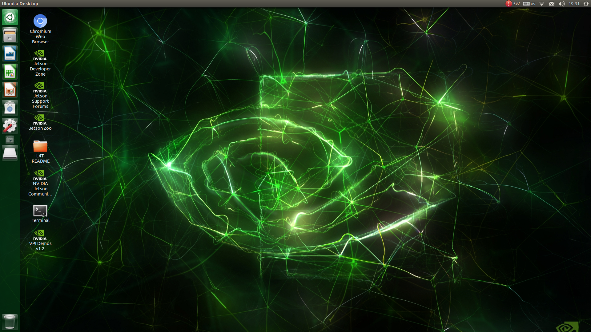
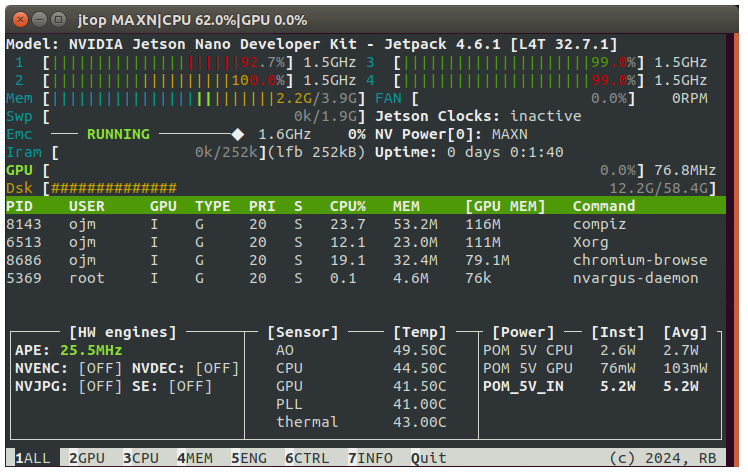
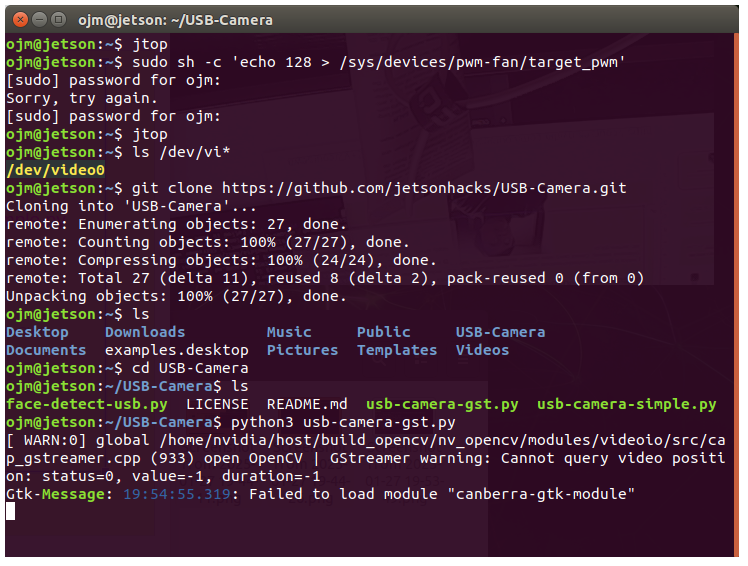

# 1️⃣for jetson nano starters... 
기본적으로 SD 카드 형식과 이미지 파일을 구워야 합니다.

*Basically, you have to burn the SD card format and image file.*

이미지 파일은

*The image file is*
[here](https://developer.nvidia.com/embedded/downloads#?search=nano)
1. download - jetpack 4.6.1 
2. sd card formatter [Format the sd card]
3. balena etcher [Write the image]
4. [how to](https://developer.nvidia.com/embedded/learn/get-started-jetson-nano-devkit#write)

screen

---
# 2️⃣jtop operation
jtop은 시스템 모니터링 도구이다

*jtop is a system monitoring tool.*

터미널을 열어 확인합니다

*Open the terminal to check*
```
sudo apt-get update
sudo apt-get upgrade
```
*1. Prepare your system to install or update software based on the latest information*

*2. Update packages already installed on your system to keep them up to date*

1. 최신 정보를 기반으로 소프트웨어를 설치하거나 업데이트할 수 있도록 시스템 준비하기
2. 시스템에 이미 설치된 패키지를 업데이트하여 최신 상태로 유지하기

*3. Install Python*

```
sudo apt install python3-pip
```

*4. Check after installation: verify jetson-stats are installed properly with the jtop command*
4.리부팅 후 jtop 명령으로 올바르게 설치되었는지 확인

```
sudo -H pip3 install -U jetson-stats
reboot
```

**jetson-stats 설치확인**

```pip3 list| grep jetson```


   

---
# 3️⃣Install and run cooling fan

jtop을 실행해 온도를 확인해 보면 온도가 꽤 높습니다.

*After running jtop, check the temperature. The temperature is very high.*

쿨링팬을 장착하고 자동 제어를 설정합니다.

## (선택) 팬이 잘 도는지 즉시 확인

장착 직후 한 줄로 팬을 돌려볼 수 있습니다:

```
sudo sh -c 'echo 128 > /sys/devices/pwm-fan/target_pwm'   # 끄기: 128 대신 0
```

## 자동 팬 제어 설치 — 이 방법 하나면 끝!

`jetson-fan-ctl`을 설치하면 **부팅할 때 자동으로 시작**되고, **온도에 따라 팬 속도를 알아서 조절**해 줍니다.
터미널에서 한 줄씩:

```
git clone https://github.com/jugfk/jetson-fan-ctl.git
cd jetson-fan-ctl
sudo sh install.sh
```

설치가 끝나면 `automagic-fan` 서비스가 자동 등록되어, **재부팅해도 항상 동작**합니다.
별도의 스크립트 작성이나 서비스 등록 작업은 필요 없습니다.

### 동작 확인 및 제어

```
sudo service automagic-fan status   # 상태 확인 (active면 성공, 종료는 q)
sudo service automagic-fan stop     # 잠깐 중지
sudo service automagic-fan start    # 다시 시작
```

`jtop`으로 온도가 내려가는지 확인해 보세요. 약 10도 정도 떨어지는 경우도 있습니다.

*Install jetson-fan-ctl once — it starts automatically at boot and adjusts fan speed by temperature.*

---
# 4️⃣Installing the Camera

USB 카메라와 CSI 카메라 중 **가지고 있는 카메라에 맞는 방법 하나만** 따라 하면 됩니다.

## 4-A. USB 카메라 (일반 웹캠)
[Sources](https://github.com/jetsonhacks/USB-Camera)
```
git clone https://github.com/jetsonhacks/USB-Camera.git
```

After 'git clone', run 'ls' to check the folder.

A 'USB-Camera' directory has been created, and it goes into 'USB-Camera'

   

If you check the list of 'USB-Camera', there is a py-in python file. 

You can run it with python3 commands

카메라 테스트 와 Finding eyes, nose, and mouth  각각 실행해본다
```
cd USB-Camera
python3 usb-camera-gst.py 
python3 face-detect-usb.py 
```

## 4-B. CSI 카메라 (라즈베리파이 카메라 모듈 v2 등)
[Sources](https://github.com/JetsonHacksNano/CSI-Camera)

**연결 (⚠️ 전원을 끈 상태에서!)**

1. CSI 커넥터의 검은색 걸쇠를 위로 살짝 들어 올린다.
2. 리본 케이블을 **금속 접점이 방열판(히트싱크) 쪽**을 향하게 끼운다. (파란 면이 바깥쪽)
3. 걸쇠를 다시 눌러 고정하고 전원을 켠다.

**인식 확인**

```
ls /dev/video0
```

**예제 실행**

```
git clone https://github.com/JetsonHacksNano/CSI-Camera.git
```

카메라 테스트 와 얼굴 인식을 각각 실행해본다
```
cd CSI-Camera
python3 simple_camera.py
python3 face_detect.py
```

창을 닫을 때는 창을 클릭한 후 `Ctrl+C` 또는 `q`

> 💡 CSI 카메라는 DLI 도커 컨테이너 안에서도 그대로 사용할 수 있습니다.
> JupyterLab 실습에서 `usb_camera.ipynb` 대신 `csi_camera.ipynb` 를 열면 됩니다.


[🙋‍♂️ next hangul install](./2_한글설치.md)
