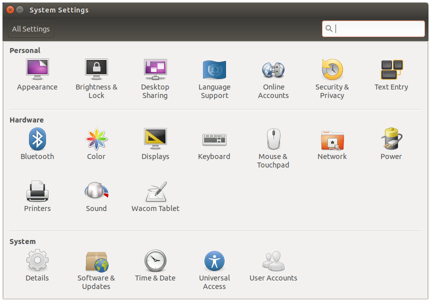

# 한글 설치 (선택)

젯슨나노는 기본적으로 영어 환경입니다. 한글 입력이 필요하면 `fcitx-hangul` 입력기를 설치합니다.

혹시 아직 업데이트를 하지 않았다면 먼저 해줍니다:

```
sudo apt-get update
```

**입력기 설치 후 재부팅:**

```
sudo apt-get install fcitx-hangul
im-config -n fcitx
reboot
```

재부팅이 끝나면 **Settings(설정) → Language Support** 에서 한글 관련 설정을 마무리합니다.
자세한 화면별 설정은 아래 참고 링크를 보면서 따라 하세요.



[한글 설치 참고 링크](https://driz2le.tistory.com/253)

---

[🙋‍♂️ 다음 단계: 스왑 설정과 도커](./3_docker_and_swap.md)
