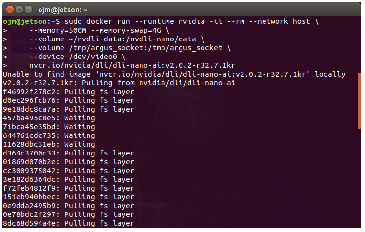
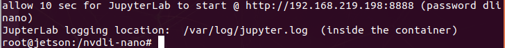
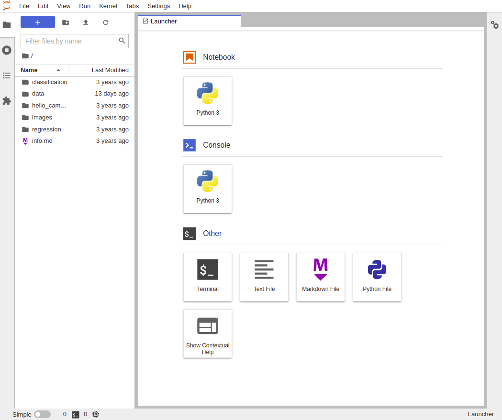
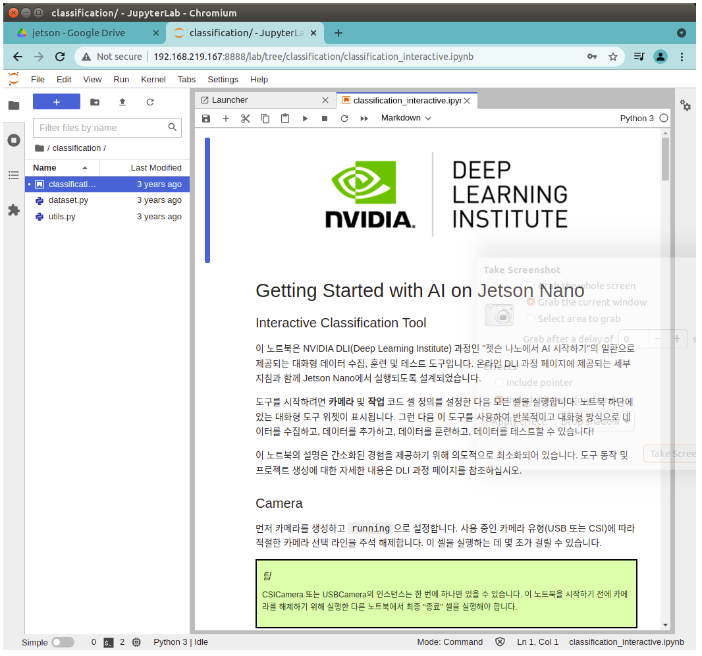

# 1️⃣doker 설치와 준비

nvidia에서 제공되는 머신러닝 실습을 하기위해 도커컨텐이너를 만들고 
그곳에서 실습을 실행하기 위한 과정이다. 

## 도커(Docker)를 사용하는 이유

NVIDIA의 DLI 과정에서는 보통 AI, 머신러닝(ML), 딥러닝(DL) 관련 실습을 진행하는데
이 과정에서 Docker를 사용한다.

### 1. 환경 설정의 편리함
AI/ML/DL 개발에는 다양한 라이브러리(PyTorch, TensorFlow, CUDA 등)가 필요

**📌 문제점:** 각 라이브러리 버전이 다르면 충돌할 수도 있음.

**📌 해결책:** 도커 컨테이너를 사용하면, 모든 종속성을 미리 설정된 환경에서 실행할 수 있음.

🚀 즉, 참가자마다 개별적으로 라이브러리를 설치할 필요 없이, 동일한 환경에서 실습 가능!


### 2. 호환성 문제 해결
DLI 과정에서는 NVIDIA GPU가 필요할 가능성이 큼.

**📌 문제점:** CUDA, cuDNN, 드라이버 버전이 맞지 않으면 GPU 가속이 안 될 수 있음.

**📌 해결책:** 도커 컨테이너에는 적절한 CUDA 및 cuDNN 환경이 포함되어 있어서, 실행 환경이 통일됨.

💡 즉, 도커 컨테이너를 사용하면 하드웨어 및 드라이버 호환성 문제를 방지할 수 있음!

### 3. 재현성 & 일관성 유지
AI 실험을 진행할 때, 환경이 조금만 달라져도 결과가 달라질 수 있다.

**📌 문제점:** "내 컴퓨터에서는 잘 되는데, 왜 네 컴퓨터에서는 안 돼?"

**📌 해결책:** 도커는 특정 환경(파이썬 패키지, GPU 드라이버 등)을 완전히 동일하게 유지할 수 있어.

🔄 즉, 어떤 시스템에서도 동일한 실험 결과를 재현할 수 있도록 보장해 줌!

### 4. 실행 속도 최적화
NVIDIA 도커(nvidia-docker)는 GPU 가속을 지원하는 컨테이너 환경을 제공

**📌 문제점:** 일반적인 가상환경(예: conda)에서는 GPU 활용이 어려울 수도 있음.

**📌 해결책:** nvidia-docker를 사용하면, 컨테이너 내부에서 GPU 자원을 효율적으로 사용할 수 있음.

🔥 즉, 도커 컨테이너를 사용하면 GPU 성능을 최대로 활용할 수 있음!

### 5. 손쉬운 배포 & 공유
DLI 과정이 끝난 후에도, 동일한 환경을 유지하면서 다른 사람과 공유할수 있다.

**📌 문제점:** 실습한 코드를 다른 PC에서 실행하려면 환경을 다시 설정해야 할 수도 있음.

**📌 해결책:** 도커 컨테이너를 공유하면, 어떤 시스템에서도 동일한 환경에서 실행 가능!

🌍 즉, 도커 이미지를 공유하면 실험 및 연구를 쉽게 재현하고 배포할 수 있음!

## 도커의 원리 — 컨테이너는 어떤 "가상환경"인가?

도커도 가상환경의 한 종류지만, 가상머신(VM)처럼 OS를 통째로 하나 더 띄우는 방식이 **아니다**.

### VM vs 컨테이너

| | 가상머신(VM) | 도커 컨테이너 |
|---|---|---|
| 구조 | 하이퍼바이저 위에 **게스트 OS 전체**를 설치 | 호스트 **리눅스 커널을 공유**하고 프로세스만 격리 |
| 크기/속도 | 수 GB, 부팅에 수 분 | 수백 MB, 시작 몇 초 |
| 젯슨나노 2GB | ❌ 램 부족으로 사실상 불가 | ✅ 가능 — DLI가 도커를 택한 이유 |

### 격리를 만드는 리눅스 커널의 두 기능

1. **네임스페이스(namespace)** : 컨테이너 안 프로세스에게 자기만의 파일시스템·네트워크·프로세스 목록만 보이게 한다. 그래서 컨테이너 안은 별도의 컴퓨터처럼 보인다.
2. **cgroups** : 컨테이너가 쓸 CPU·메모리 자원에 상한을 건다. 우리가 쓰는 `--memory=500M --memory-swap=4G` 옵션이 바로 cgroups 기능이다.

### 이미지와 컨테이너의 관계

- **이미지** = 실행에 필요한 모든 것(우분투 라이브러리 + CUDA + PyTorch + JupyterLab + 실습 노트북)을 **층층이(layer) 쌓아 얼려둔 스냅샷**. 읽기 전용이다.
- **컨테이너** = 이미지를 실행한 **인스턴스**. 같은 이미지로 몇 개든 띄울 수 있다.
- `--rm` 옵션 때문에 컨테이너는 종료 시 삭제된다. 그래서 실습 데이터는 `--volume ~/nvdli-data:...`로 **호스트 폴더에 연결(마운트)**해서 컨테이너 밖에 남긴다.
- `--runtime nvidia`는 NVIDIA 컨테이너 런타임으로 **컨테이너 안에서도 젯슨의 GPU**를 쓸 수 있게 연결해준다.

### venv / 도커 / VM 격리 수준 비교

```
가벼움 ◀─────────────────────────────▶ 무거움
python venv        도커 컨테이너        가상머신(VM)
(파이썬 패키지만)   (OS 라이브러리까지)   (커널·OS 전체)
```

**과정**

1. DLI docker 설치 준비.
2. DLI docker이미지를 설치.
3. 카메라 연결과 동작까지 확인
4. 젯슨은 유선(이더넷) 또는 무선(WiFi)로 인터넷에 연결되어있어야합니다. 

---

# 2️⃣swap 설정 — ⚠️ 도커 실행 전에 먼저!
Jetson 보드에서 Docker 컨테이너를 실행할 때 발생하는 메모리 문제를 해결하기 위해 swap을 사용한다.
**특히 2GB 모델은 스왑 없이 도커 실습을 하면 반드시 멈추므로, 도커(3️⃣)보다 먼저 해야 한다.**

> 💡 **2GB vs 4GB** :
> - **2GB 모델** — 스왑이 **필수**. 없으면 모델 훈련 중 반드시 멈춘다. 아래 절차 전부 진행 (18~20GB 권장).
> - **4GB 모델** — 스왑이 **권장**. 기초 실습은 스왑 없이도 돌지만, 모델 훈련이나 CSI 카메라 사용 시
>   멈춤 방지를 위해 만들어 두는 것이 좋다. 절차는 동일하고 크기만 줄여도 된다 (예: `fallocate -l 8G /mnt/8GB.swap`,
>   이후 명령의 파일명도 `8GB.swap`으로 통일). GUI를 계속 쓰고 싶다면 `set-default multi-user.target`(headless 전환)
>   단계는 건너뛰어도 된다.

Jetson 보드는 메모리가 제한적이므로, Docker 컨테이너를 원활하게 실행하기 위해 
ZRAM을 비활성화하면 CPU 사용량을 줄이고, Docker 컨테이너가 더 많은 메모리를 사용할 수 있다

ZRAM을 비활성화하고, 스왑(Swap) 파일을 추가하는 작업을 수행하는 것

만약 Docker 컨테이너가 여러 개 실행될 경우, RAM이 부족하면 컨테이너가 충돌하거나 종료된다.

이를 방지하기 위해 스왑을 생성하여 가상 메모리를 추가하는 것

| 과정 | 이유 |
| --- | --- |
| ZRAM 비활성화 ```systemctl disable nvzramconfig```| CPU 사용량을 줄이고, 스왑을 직접 사용할 수 있도록 함 | 
| 스왑 파일 생성 ```fallocate -l 18G /mnt/18GB.swap``` | 메모리가 부족할 경우 추가적인 가상 메모리를 제공| 
| GUI 비활성화 ```systemctl set-default multi-user.target```| Docker 컨테이너 실행 시 GUI가 필요 없다면 RAM 사용량을 줄이기 위해 비활성화 |
| GUI 활성화| ```sudo systemctl set-default graphical.target```|


```multi-user.target```을 설정하면 GUI를 사용하지 않으므로 RAM 사용량이 줄어들기도 한다.


 **ZRAM 비활성화**

```
sudo systemctl disable nvzramconfig
```

 **스왑 파일 생성**
```
sudo fallocate -l 18G /mnt/18GB.swap
sudo chmod 600 /mnt/18GB.swap
sudo mkswap /mnt/18GB.swap
```

**부팅 시 자동 적용을 위해 /etc/fstab에 추가**
```
echo "/mnt/18GB.swap swap swap defaults 0 0" | sudo tee -a /etc/fstab
```

**스왑 파일 적용 (재부팅 없이 적용 가능)**

```sudo swapon /mnt/18GB.swap```

**스왑이 정상적으로 적용되었는지 확인**
```
free -h
swapon --show
```

**시스템 재부팅**
```sudo reboot```


✅ 재부팅까지 끝났으면 스왑 준비 완료! 이제 아래 3️⃣에서 도커를 실행한다.

---

# 3️⃣도커 실행 — 처음부터 스크립트로!

**① 데이터 폴더 만들기** (실습 결과가 컨테이너 밖에 남는 곳):

```mkdir -p ~/nvdli-data```

**② 실행 스크립트 `docker_dli_run.sh` 만들기 (한 번만)**

도커 실행 명령이 매우 길기 때문에, 직접 치지 말고 **처음부터 스크립트 파일로 저장**해서 사용한다.
아래 `echo "..." > docker_dli_run.sh`는 따옴표 안의 긴 도커 명령을 파일로 저장하는 명령이다.
**내 모델(2GB/4GB)에 맞는 것 하나만** 실행하면 된다:

### 💡 2GB 모델은 스크립트를 이렇게 만든다

```
echo "sudo docker run --runtime nvidia -it --rm --network host \
    --memory=500M --memory-swap=4G \
    --volume ~/nvdli-data:/nvdli-nano/data \
    --volume /tmp/argus_socket:/tmp/argus_socket \
    --device /dev/video0 \
    nvcr.io/nvidia/dli/dli-nano-ai:v2.0.2-r32.7.1kr" > docker_dli_run.sh

chmod +x docker_dli_run.sh    # 실행 권한 부여
```

### 💡 4GB 모델(일반 젯슨나노)은 스크립트를 이렇게 만든다

`--memory=500M --memory-swap=4G`는 램이 부족한 2GB에서 컨테이너의 메모리 사용을
강제로 제한하는 옵션이므로, **4GB 모델은 이 두 옵션을 뺀 스크립트**를 만든다
(NVIDIA 공식 DLI 문서의 4GB용 명령과 동일):

```
echo "sudo docker run --runtime nvidia -it --rm --network host \
    --volume ~/nvdli-data:/nvdli-nano/data \
    --volume /tmp/argus_socket:/tmp/argus_socket \
    --device /dev/video0 \
    nvcr.io/nvidia/dli/dli-nano-ai:v2.0.2-r32.7.1kr" > docker_dli_run.sh

chmod +x docker_dli_run.sh
```

| | 2GB 모델 | 4GB 모델 |
| --- | --- | --- |
| 메모리 제한 옵션 | `--memory=500M --memory-swap=4G` **필수** | **생략** (제한 없이 사용) |
| 컨테이너 이미지 | 동일 (`dli-nano-ai:v2.0.2-r32.7.1kr`) | 동일 |
| 실행 방법 | `./docker_dli_run.sh` | `./docker_dli_run.sh` (동일) |

**③ 실행 — 이제부터는 언제나 이 한 줄뿐!**

```
./docker_dli_run.sh
```

처음 한 번은 이미지를 다운로드하므로 시간이 제법 걸린다. (와이파이가 끊기면 다시 실행)

## 스크립트 안에 들어있는 도커 명령 옵션 설명

|옵션|설명|
| --- | --- |
|sudo docker run|새로운 컨테이너를 실행|
|--runtime nvidia|NVIDIA GPU를 사용할 수 있도록 설정|
|-it|인터랙티브(터미널에서 사용 가능) 모드|
|--rm|컨테이너 종료 시 자동 삭제|
|--network host|호스트 네트워크 사용 (Jetson Nano의 네트워크를 직접 사용)|
|--volume ~/nvdli-data:/nvdli-nano/data	|호스트의 ~/nvdli-data 폴더를 컨테이너 내 /nvdli-nano/data로 마운트|
|--device /dev/video0|Jetson Nano의 카메라 장치를 컨테이너에서 사용할 수 있도록 설정|
|nvcr.io/nvidia/dli/dli-nano-ai:v2.0.2-r32.7.1kr|NVIDIA에서 제공하는 AI 실습 컨테이너 이미지|




**Docker가 설치되어 있는지 확인**

```docker --version```

**Docker 서비스 상태 확인**

```sudo systemctl status docker```

**Jetson에서 Docker GPU 지원(nvidia 런타임) 확인 (Jetson만 해당)**

```sudo docker info | grep -i nvidia```

출력에 `nvidia` 런타임이 보이면 GPU 지원 준비가 된 것.

> ⚠️ 참고: PC용 문서에 나오는 `nvidia-smi` 명령은 **젯슨에서는 동작하지 않는다**
> (Tegra 계열엔 nvidia-smi가 없음). 젯슨에서 GPU 상태 확인은 `jtop`을 사용한다.




# 4️⃣jupyter notebook 사용하기
*http://192.168.***.***:8888 (password dlinano)*

화면에 나온 ip주소를 브라우저로 연결한다

password는 보통 dlinano 라고 알려준다.

   

## thumn up and thumn down
여기서 **classification** 을 선택해서 들어간다

  

[4_classification_interactive.ipynb](./4_classification_interactive.ipynb)

---

[🙋‍♂️ 5.next thumbs up down ](./4_classification_interactive.ipynb)

[🙋‍♂️ 6.next arduino for jetson](../03_arduino_sensor/arduino_sensor_for_jetson.md)

