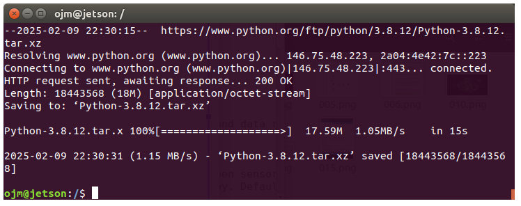
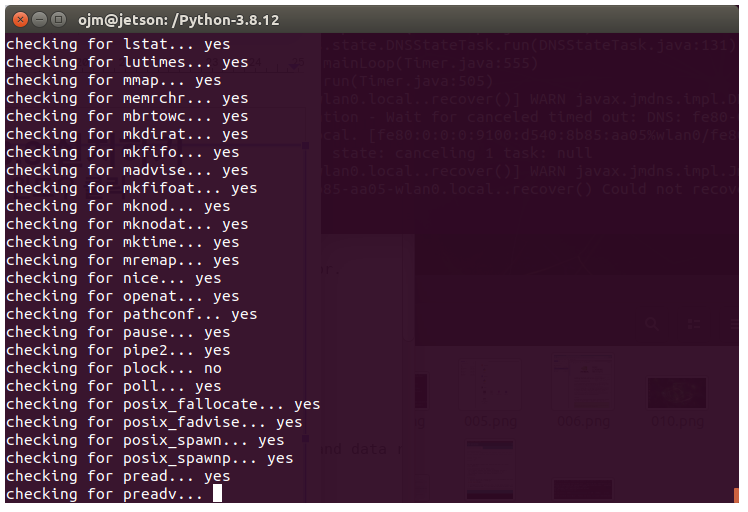
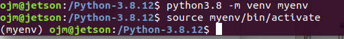
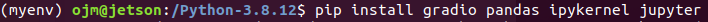
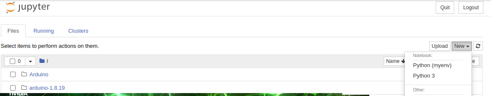
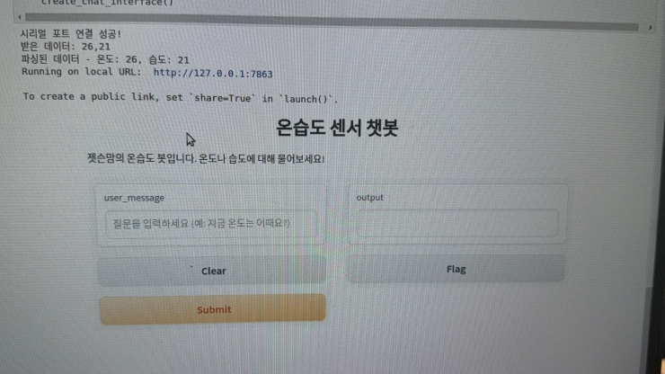
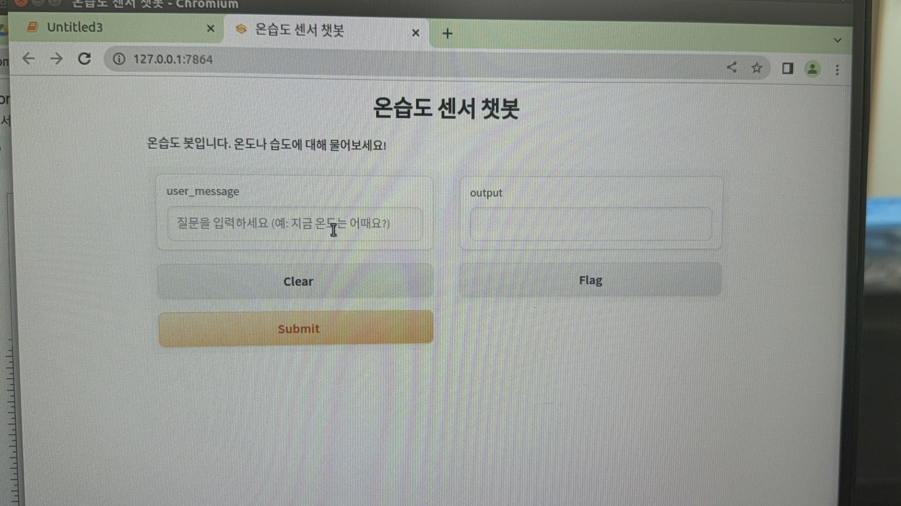

# 파이썬 3.8 설치와 가상환경(venv), 주피터 노트북

> 🧭 **어디서 실행하나요?** 이 문서의 모든 명령은 **DLI 도커 컨테이너가 아니라 젯슨나노 호스트 터미널**에서 실행합니다.
> DLI 컨테이너는 DLI 수료 과정 전용이고 `--rm` 옵션 때문에 종료하면 사라지므로, 거기에 설치하면 다음에 다 날아갑니다.
> 챗봇·아두이노 과정은 호스트에 직접 만드는 이 환경을 사용합니다.

## ⏩ 이미 설치했다면 건너뛰기

```bash
python3.8 --version
```

- 버전이 나오면 (예: `Python 3.8.12`) → 설치 완료된 것이니 아래 **[venv 섹션](#venv)** 으로 바로 가세요.
- `command not found`가 나오면 → 아래 설치를 진행하세요.

> ⏰ **수업 팁** : `make -j4` 컴파일에 1시간 이상 걸립니다. **수업 시작하자마자 여기까지 걸어두고**,
> 컴파일이 도는 동안 [03_arduino_sensor(아두이노 연결)](../03_arduino_sensor/arduino_sensor_for_jetson.md)를 진행하면 시간이 딱 맞습니다.

---

# python3.8 설치

젯슨나노 기본 우분투(18.04)의 파이썬은 3.6이라서, openai 패키지(3.8 이상 필요)를 쓰려면 3.8을 소스 빌드로 설치합니다.

**✅ ① 개발 라이브러리 먼저 설치** (⚠️ 반드시 `./configure` **전에**! configure는 실행 시점에 설치된 라이브러리를 검사합니다)

```bash
sudo apt update
sudo apt install -y build-essential libssl-dev libffi-dev \
    libgdbm-dev libnss3-dev libreadline-dev libsqlite3-dev \
    libbz2-dev liblzma-dev libncurses5-dev libncursesw5-dev \
    zlib1g-dev tk-dev sqlite3
```

설치되는 주요 패키지:

- `build-essential` : C/C++ 컴파일러 및 필수 빌드 도구
- `libssl-dev` : OpenSSL (pip가 https로 패키지를 받을 때 필요)
- `libffi-dev` : 외부 함수 인터페이스 (파이썬 패키지 빌드 시 필요)
- `libsqlite3-dev` : SQLite — **jupyter가 사용**
- `libbz2-dev` : bz2 압축 — **pandas가 사용**
- `zlib1g-dev` : 압축 관련 라이브러리, `tk-dev` : Tkinter GUI

**✅ ② python3.8 소스코드 받고 압축 풀기**

```bash
cd ~
wget https://www.python.org/ftp/python/3.8.12/Python-3.8.12.tar.xz
tar -xf Python-3.8.12.tar.xz
cd Python-3.8.12
```



**✅ ③ 빌드 설정 → 컴파일 → 설치**

```bash
./configure --enable-loadable-sqlite-extensions --with-bz2
make -j4
sudo make altinstall
```

- `make -j4` : CPU 4코어를 사용해 병렬로 컴파일 (⏰ 1시간 이상 — 이 동안 아두이노 진행!)
- ⚠️ **반드시 `altinstall`** — `make install`을 쓰면 시스템 기본 python3(3.6)이 덮어써져서
  apt 등 우분투 자체 도구가 **깨질 수 있습니다.** `altinstall`은 기본 파이썬을 건드리지 않고 `python3.8` 명령만 추가합니다.

**✅ ④ 확인**

```bash
python3.8 --version
```

`Python 3.8.12`가 나오면 성공!



---

# venv

venv는 **Python의 가상 환경(Virtual Environment)** 을 생성하는 도구입니다.

- 프로젝트마다 독립적인 패키지 환경을 유지할 수 있게 해줍니다.
- 파이썬 3.3 이상부터 기본 내장이라 별도 설치가 필요 없습니다.

## 가상환경 만들고 실행



```bash
cd ~
python3.8 -m venv myenv
source myenv/bin/activate
```

- ⚠️ `python3 -m venv`가 아니라 **`python3.8 -m venv`** — python3는 시스템 기본(3.6)을 가리키므로 반드시 3.8로 만들어야 합니다.
- 활성화되면 프롬프트 앞에 `(myenv)`가 표시됩니다: `(myenv) dli@nano:~$`

**자주 쓰는 명령어:**

| 하고 싶은 것 | 명령어 |
|---|---|
| 가상환경 활성화 | `source myenv/bin/activate` |
| 가상환경 나가기 | `deactivate` |
| 가상환경 삭제 후 새로 만들기 | `rm -rf myenv` → 다시 생성 |

> 💡 **재부팅하거나 새 터미널을 열면 가상환경이 풀려 있습니다.**
> 챗봇 실습 전에는 항상 `source myenv/bin/activate` 부터!

## 필요한 패키지들 설치 (가상환경 안에서!)


```bash
python -m pip install --upgrade pip
pip install jupyter gradio pandas ipykernel openai pyserial
```



**✅ Jetson.GPIO** — 젯슨 보드의 GPIO 핀을 제어하는 라이브러리 (GPIO 직결 센서를 쓸 때만 필요)

```bash
pip install Jetson.GPIO
```

**✅ 가상환경을 Jupyter kernel로 등록**

```bash
python -m ipykernel install --user --name=myenv --display-name="Python (myenv)"
jupyter notebook
```

주피터 노트북에서 새 파일을 만들 때 **`Python (myenv)`** 커널을 선택해서 만듭니다.



Running on local URL 을 실행하면 새로운 창에 챗봇이 나옵니다.





---

## 부록: 트러블슈팅

| 증상 | 원인 | 해결 |
|---|---|---|
| jupyter 실행 시 `No module named '_sqlite3'` | sqlite 라이브러리 없이 컴파일됨 | `sudo apt install libsqlite3-dev` → Python-3.8.12 폴더에서 `./configure --enable-loadable-sqlite-extensions --with-bz2` → `make -j4` → `sudo make altinstall` → venv 삭제 후 재생성 |
| pandas import 시 `No module named '_bz2'` | bz2 라이브러리 없이 컴파일됨 | `sudo apt install libbz2-dev` → 위와 동일하게 재컴파일 (**반드시 altinstall!**) |
| 노트북에서 `No module named 'serial'` | 주피터가 가상환경 커널을 안 씀 | `pip install pyserial ipykernel` → `python -m ipykernel install --user --name=myenv` → 주피터에서 Kernel → Change kernel → `Python (myenv)` 선택 |
| pip install이 느리거나 멈춤 | 스왑 부족 또는 네트워크 | [스왑 설정](../01_jetson_dli_course/3_docker_and_swap.md) 확인, 와이파이 재연결 |

[🙋‍♂️ 다음 단계: 아두이노 + DHT11 센서 연결](../03_arduino_sensor/arduino_sensor_for_jetson.md)
