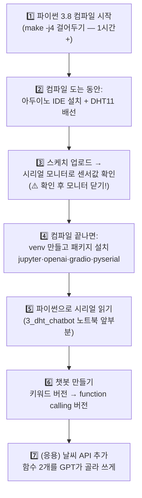

# 🤖 센서 챗봇 과정 전체 가이드 — 무엇을 어떤 순서로?

DHT11 온습도 센서 값을 읽어서 "지금 온도 어때?"라고 물으면 대답하는 챗봇을 만드는 과정입니다.
**아두이노(하드웨어) 먼저, 챗봇(소프트웨어) 나중** 순서로 진행합니다.

## 🧭 시작 전에 꼭 알아둘 것: 도커 안? 밖?

| | DLI 도커 컨테이너 | 이 과정 (챗봇/아두이노) |
|---|---|---|
| 용도 | DLI 수료 과정 전용 (thumbs 분류 등) | 센서 + function calling 챗봇 |
| 실행 위치 | `./docker_dli_run.sh`로 진입 | **젯슨나노 호스트 터미널 그대로** |
| 파이썬 | 컨테이너에 이미 내장 | **호스트에 python3.8 직접 설치** |
| 특징 | `--rm`이라 종료하면 사라짐 | 설치한 것이 계속 남음 |

> ⚠️ **이 과정의 모든 명령은 도커 컨테이너 "밖"에서 실행합니다.**
> 컨테이너 안에 설치하면 컨테이너 종료와 함께 전부 사라지고, 아두이노 시리얼 포트 접근도 복잡해집니다.
> 프롬프트가 `root@...:/nvdli-nano#` 모양이면 컨테이너 안에 있는 것이니 `exit`로 나온 후 진행하세요.
> (구분법: [3_docker_and_swap.md — 호스트 vs 컨테이너](../01_jetson_dli_course/3_docker_and_swap.md))

## 🗺️ 전체 순서 (⏰ 시간 절약 순서로 배치)



| 단계 | 할 일 | 문서 | 시간 |
|---|---|---|---|
| 1 | **파이썬 3.8 컴파일 걸어두기** (수업 시작하자마자!) | [02_python_jupyter](../02_python_jupyter/python_jupyter_venv.md) | 걸어두면 끝 |
| 2 | 아두이노 IDE 설치 + DHT11 배선 | [03_arduino_sensor](../03_arduino_sensor/arduino_sensor_for_jetson.md) | 40분 |
| 3 | 스케치 업로드 + 시리얼 모니터 확인 | [03_arduino_sensor](../03_arduino_sensor/arduino_sensor_for_jetson.md) | 20분 |
| 4 | venv + 패키지 설치 (컴파일 끝난 후) | [02_python_jupyter — venv](../02_python_jupyter/python_jupyter_venv.md#venv) | 20분 |
| 5 | function calling 개념 + 5단계 실습 | [1_function_calling.md](./1_function_calling.md) | 40분 |
| 6 | 챗봇 실습 전 체크리스트 → 센서 챗봇 | [2_arduino_dhtSensor.md](./2_arduino_dhtSensor.md) → [3_dht_chatbot(노트북)](./3_dht_chatbot_functioncalling.ipynb) | 40분 |
| 7 | (응용) 날씨 API 챗봇 — 함수 여러 개 | [4_api_chatbot.md](./4_api_chatbot.md) | 40분 |

## ⏩ 파이썬을 이미 설치했다면?

```bash
python3.8 --version    # 버전이 나오면 설치 완료
```

버전이 나오면 1·4단계는 건너뛰고, [venv 활성화](../02_python_jupyter/python_jupyter_venv.md#venv)만 하고 2단계(아두이노)부터 진행하세요.

## 🔑 준비물 체크리스트

- [ ] 아두이노 보드 (우노 또는 호환보드) + USB 케이블
- [ ] DHT11 온습도 센서 + 점퍼선 3개
- [ ] OpenAI API 키 — [platform.openai.com/api-keys](https://platform.openai.com/api-keys)에서 발급
  - ⚠️ **API 키는 문서·슬라이드·깃허브에 절대 그대로 적지 않기!** 코드에서는 자리표시자(`'여기에 본인 키 입력'`)를 쓰고 실습 때만 입력합니다.
- [ ] (7단계용) OpenWeatherMap 무료 키 — [openweathermap.org](https://openweathermap.org/) 가입 후 발급

## 자주 막히는 곳 미리보기

| 증상 | 원인 | 어디를 볼까 |
|---|---|---|
| 파이썬에서 센서값이 안 읽힘 | **아두이노 시리얼 모니터가 열려 있음** (포트 독점) | [2_arduino_dhtSensor 체크리스트](./2_arduino_dhtSensor.md) |
| `could not open port` | 포트 이름이 다름 (ttyACM0 vs ttyUSB0) 또는 권한 없음 | [03 문서 7~8번](../03_arduino_sensor/arduino_sensor_for_jetson.md) |
| 값이 깨져서 나옴 | 통신속도(baud) 불일치 | [03 문서 통신속도 표](../03_arduino_sensor/arduino_sensor_for_jetson.md) |
| `No module named 'serial'` | 주피터가 venv 커널을 안 씀 | [02 문서 트러블슈팅](../02_python_jupyter/python_jupyter_venv.md) |
| openai 패키지 설치 실패 | python3.6에 설치 시도 중 (venv 안 켬) | `source myenv/bin/activate` 먼저 |

[🙋‍♂️ 시작: 1_function_calling.md — 개념부터](./1_function_calling.md)
