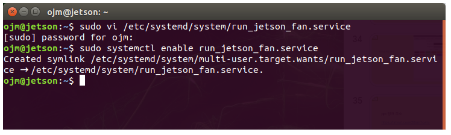

# for jetson nano starters... 
기본적으로 SD 카드 형식과 이미지 파일을 구워야 합니다.

*Basically, you have to burn the SD card format and image file.*

이미지 파일은

*The image file is*
[here](https://developer.nvidia.com/embedded/downloads#?search=nano)
1. download - jetpack 4.6.1 
2. sd card formatter [Format the sd card]
3. balena etcher [Write the image]
4. [how to](https://developer.nvidia.com/embedded/learn/get-started-jetson-nano-devkit#write)

screen

---
# jtop operation
jtop은 시스템 모니터링 도구이다

*jtop is a system monitoring tool.*

터미널을 열어 확인합니다

*Open the terminal to check*
```
sudo apt-get update
sudo apt-get upgrade
```
*1. Prepare your system to install or update software based on the latest information*

*2. Update packages already installed on your system to keep them up to date*

1. 최신 정보를 기반으로 소프트웨어를 설치하거나 업데이트할 수 있도록 시스템 준비하기
2. 시스템에 이미 설치된 패키지를 업데이트하여 최신 상태로 유지하기

*3. Install Python*

```
sudo apt install python3-pip
```

*4. Check after installation: verify jetson-stats are installed properly with the jtop command*
4.리부팅 후 jtop 명령으로 올바르게 설치되었는지 확인

```
sudo -H pip3 install -U jetson-stats
reboot
```

**jetson-stats 설치확인**

```pip3 list| grep jetson```


   

---
# Install and run cooling fan 

After running jtop
Check the temperature.
The temperature is very high.
Install and run the cooling fan

**Run Terminal**

## 1. jetson_clocks 명령어 사용

팬을 항상 작동시키려면 아래 명령어를 입력합니다:
```
sudo /usr/bin/jetson_clocks --fan

# 깃허브에서 설치하는 방법
git clone https://github.com/jugfk/jetson-fan-ctl.git
cd jetson-fan-ctl
sudo sh install.sh
```

이 방법은 재부팅하면 초기화되므로, 

## 부팅 시 fan 자동 실행 설정

### 1.스크립트 생성

run_jetson_fan.sh 파일을 생성하고 다음 내용을 작성합니다

jetson에 기본 탑재된 vim 을 이용해 편집합니다. 
```
sudo vi /usr/bin/run_jetson_fan.sh
```

*화면이 열리면 ```s```를 눌러 편집모드로 들어갑니다*

```f1``` 도움말

```
#!/bin/bash
sudo /usr/bin/jetson_clocks --fan
exit 0
```
위 내용을 붙여넣고 

: 을 입력후 wq 를 입력하면 저장되고 빠져나오게 됩니다. 


### 2.권한설정

```sudo chmod u+x /usr/bin/run_jetson_fan.sh```


 

### 3.서비스파일 생성

``` sudo vi /etc/systemd/system/run_jetson_fan.service```


s --> 편집모드

 


```
[Unit]
Description=Run Jetson Fan
Requires=multi-user.target
After=multi-user.target

[Service]
Type=forking
Restart=on-failure
RestartSec=1s
ExecStart=/usr/bin/run_jetson_fan.sh

[Install]
WantedBy=multi-user.target
```
: wq 

### 4.서비스등록 활성화

```sudo systemctl enable run_jetson_fan.service```

-끝-


### 5.팬 동작 확인 및 제어:

```
sudo service automagic-fan start   # 시작
sudo service automagic-fan stop    # 중지
sudo service automagic-fan status # 상태 확인
```

*상태확인후 shift+q*


---
# Installing the Camera
[Sources](https://github.com/jetsonhacks/USB-Camera)
```
git clone https://github.com/jetsonhacks/USB-Camera.git
```

After 'git clone', run 'ls' to check the folder.

A 'USB-Camera' directory has been created, and it goes into 'USB-Camera'

   

If you check the list of 'USB-Camera', there is a py-in python file. 

You can run it with python3 commands

카메라 테스트 와 Finding eyes, nose, and mouth  각각 실행해본다
```
cd USB-Camera
python3 usb-camera-gst.py 
python3 face-detect-usb.py 
```
