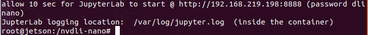

# 1️⃣doker 설치와 준비

nvidia에서 제공되는 머신러닝 실습을 하기위해 도커컨텐이너를 만들고 
그곳에서 실습을 실행하기 위한 과정이다. 

## 도커(Docker)를 사용하는 이유

NVIDIA의 DLI 과정에서는 보통 AI, 머신러닝(ML), 딥러닝(DL) 관련 실습을 진행하는데
이 과정에서 Docker를 사용한다.

### 1. 환경 설정의 편리함
AI/ML/DL 개발에는 다양한 라이브러리(PyTorch, TensorFlow, CUDA 등)가 필요

**📌 문제점:** 각 라이브러리 버전이 다르면 충돌할 수도 있음.

**📌 해결책:** 도커 컨테이너를 사용하면, 모든 종속성을 미리 설정된 환경에서 실행할 수 있음.

🚀 즉, 참가자마다 개별적으로 라이브러리를 설치할 필요 없이, 동일한 환경에서 실습 가능!


### 2. 호환성 문제 해결
DLI 과정에서는 NVIDIA GPU가 필요할 가능성이 큼.

**📌 문제점:** CUDA, cuDNN, 드라이버 버전이 맞지 않으면 GPU 가속이 안 될 수 있음.

**📌 해결책:** 도커 컨테이너에는 적절한 CUDA 및 cuDNN 환경이 포함되어 있어서, 실행 환경이 통일됨.

💡 즉, 도커 컨테이너를 사용하면 하드웨어 및 드라이버 호환성 문제를 방지할 수 있음!

### 3. 재현성 & 일관성 유지
AI 실험을 진행할 때, 환경이 조금만 달라져도 결과가 달라질 수 있다.

**📌 문제점:** "내 컴퓨터에서는 잘 되는데, 왜 네 컴퓨터에서는 안 돼?"

**📌 해결책:** 도커는 특정 환경(파이썬 패키지, GPU 드라이버 등)을 완전히 동일하게 유지할 수 있어.

🔄 즉, 어떤 시스템에서도 동일한 실험 결과를 재현할 수 있도록 보장해 줌!

### 4. 실행 속도 최적화
NVIDIA 도커(nvidia-docker)는 GPU 가속을 지원하는 컨테이너 환경을 제공

**📌 문제점:** 일반적인 가상환경(예: conda)에서는 GPU 활용이 어려울 수도 있음.

**📌 해결책:** nvidia-docker를 사용하면, 컨테이너 내부에서 GPU 자원을 효율적으로 사용할 수 있음.

🔥 즉, 도커 컨테이너를 사용하면 GPU 성능을 최대로 활용할 수 있음!

### 5. 손쉬운 배포 & 공유
DLI 과정이 끝난 후에도, 동일한 환경을 유지하면서 다른 사람과 공유할수 있다.

**📌 문제점:** 실습한 코드를 다른 PC에서 실행하려면 환경을 다시 설정해야 할 수도 있음.

**📌 해결책:** 도커 컨테이너를 공유하면, 어떤 시스템에서도 동일한 환경에서 실행 가능!

🌍 즉, 도커 이미지를 공유하면 실험 및 연구를 쉽게 재현하고 배포할 수 있음!

**과정**

1. DLI docker 설치 준비.
2. DLI docker이미지를 설치.
3. 카메라 연결과 동작까지 확인
4. 젯슨은 유선(이더넷) 또는 무선(WiFi)로 인터넷에 연결되어있어야합니다. 

---

# 2️⃣dir 추가하기
```mkdir -p ~/nvdli-data```

```#!/bin/bash```

```
#도커명령
sudo docker run --runtime nvidia -it --rm --network host \
    --memory=500M --memory-swap=4G \
    --volume ~/nvdli-data:/nvdli-nano/data \
    --volume /tmp/argus_socket:/tmp/argus_socket \
    --device /dev/video0 \
    nvcr.io/nvidia/dli/dli-nano-ai:v2.0.2-r32.7.1kr
```
|옵션|설명|
| --- | --- |
|sudo docker run|새로운 컨테이너를 실행|
|--runtime nvidia|NVIDIA GPU를 사용할 수 있도록 설정|
|-it|인터랙티브(터미널에서 사용 가능) 모드|
|--rm|컨테이너 종료 시 자동 삭제|
|--network host|호스트 네트워크 사용 (Jetson Nano의 네트워크를 직접 사용)|
|--volume ~/nvdli-data:/nvdli-nano/data	|호스트의 ~/nvdli-data 폴더를 컨테이너 내 /nvdli-nano/data로 마운트|
|--device /dev/video0|Jetson Nano의 카메라 장치를 컨테이너에서 사용할 수 있도록 설정|
|nvcr.io/nvidia/dli/dli-nano-ai:v2.0.2-r32.7.1kr|NVIDIA에서 제공하는 AI 실습 컨테이너 이미지|


## 도커 실행 스크립트 자동화
매번 긴 도커 명령어를 입력하는 대신 스크립트를 만들어 쉽게 실행할 수 있음.
```
echo "sudo docker run --runtime nvidia -it --rm --network host \
    --memory=500M --memory-swap=4G \
    --volume ~/nvdli-data:/nvdli-nano/data \
    --volume /tmp/argus_socket:/tmp/argus_socket \
    --device /dev/video0 \
    nvcr.io/nvidia/dli/dli-nano-ai:v2.0.2-r32.7.1kr" > docker_dli_run.sh

```
이 명령어는 위의 도커 실행 명령어를 docker_dli_run.sh 파일에 저장하는 것.
```
chmod +x docker_dli_run.sh  # 실행 권한 부여
./docker_dli_run.sh         # 실행
```
이제 다음부터는 ```./docker_dli_run.sh```만 입력하면 도커 실행됨.


**Docker가 설치되어 있는지 확인**

```docker --version```

**Docker 서비스 상태 확인**

```sudo systemctl status docker```

**Jetson에서 Docker GPU 지원 확인 (Jetson만 해당)**

```sudo docker run --runtime=nvidia --rm nvidia/cuda:11.0-base nvidia-smi```


---
# 3️⃣swap
Jetson 보드에서 Docker 컨테이너를 실행할 때 발생하는 메모리 문제를 해결하기 위해 swap을 사용한다

Jetson 보드는 메모리가 제한적이므로, Docker 컨테이너를 원활하게 실행하기 위해 
ZRAM을 비활성화하면 CPU 사용량을 줄이고, Docker 컨테이너가 더 많은 메모리를 사용할 수 있다

ZRAM을 비활성화하고, 스왑(Swap) 파일을 추가하는 작업을 수행하는 것

만약 Docker 컨테이너가 여러 개 실행될 경우, RAM이 부족하면 컨테이너가 충돌하거나 종료된다.

이를 방지하기 위해 스왑을 생성하여 가상 메모리를 추가하는 것

| 과정 | 이유 |
| --- | --- |
| ZRAM 비활성화 ```systemctl disable nvzramconfig```| CPU 사용량을 줄이고, 스왑을 직접 사용할 수 있도록 함 | 
| 스왑 파일 생성 ```fallocate -l 18G /mnt/18GB.swap``` | 메모리가 부족할 경우 추가적인 가상 메모리를 제공| 
| GUI 비활성화 ```systemctl set-default multi-user.target```| Docker 컨테이너 실행 시 GUI가 필요 없다면 RAM 사용량을 줄이기 위해 비활성화 |
| GUI 활성화| ```sudo systemctl set-default graphical.target```|


```multi-user.target```을 설정하면 GUI를 사용하지 않으므로 RAM 사용량이 줄어들기도 한다.


 **ZRAM 비활성화**

```
sudo systemctl disable nvzramconfig
```

 **스왑 파일 생성**
```
sudo fallocate -l 18G /mnt/18GB.swap
sudo chmod 600 /mnt/18GB.swap
sudo mkswap /mnt/18GB.swap
```

**부팅 시 자동 적용을 위해 /etc/fstab에 추가**
```
echo "/mnt/18GB.swap swap swap defaults 0 0" | sudo tee -a /etc/fstab
```

**스왑 파일 적용 (재부팅 없이 적용 가능)**

```sudo swapon /mnt/18GB.swap```

**스왑이 정상적으로 적용되었는지 확인**
```
free -h
swapon --show
```

**시스템 재부팅**
```sudo reboot```


*다시 도커 실행*
```
sudo docker run --runtime nvidia -it --rm --network host \
    --memory=500M --memory-swap=4G \
    --volume ~/nvdli-data:/nvdli-nano/data \
    --volume /tmp/argus_socket:/tmp/argus_socket \
    --device /dev/video0 \
    nvcr.io/nvidia/dli/dli-nano-ai:v2.0.2-r32.7.1kr
```


 

# 4️⃣jupyter notebook 사용하기
*http://192.168.***.***:8888 (password dlinano)*

화면에 나온 ip주소를 브라우저로 연결한다

password는 보통 dlinano 라고 알려준다.

   

## thumn up and thumn down
여기서 **classification** 을 선택해서 들어간다

  

[5_classification_interactive.ipynb](5_classification_interactive.ipynb)

---

[🙋‍♂️ 5.next thumbs up down ](https://github.com/ralralra/jetson_DLI/blob/main/5_classification_interactive.ipynb)

[🙋‍♂️ 6.next arduino for jetson](https://github.com/ralralra/jetson_DLI/blob/main/6__arduino_sensor%20for%20jetson.md)

