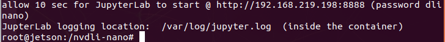

# doker 설치와 준비

1. DLI docker 설치 준비.
2. DLI docker이미지를 설치.
3. 카메라 연결과 동작까지 확인
4. 젯슨은 유선(이더넷) 또는 무선(WiFi)로 인터넷에 연결되어있어야합니다. 

# dir 추가하기
```mkdir -p ~/nvdli-data```

```#!/bin/bash```

```
#도커명령
sudo docker run --runtime nvidia -it --rm --network host \
    --memory=500M --memory-swap=4G \
    --volume ~/nvdli-data:/nvdli-nano/data \
    --volume /tmp/argus_socket:/tmp/argus_socket \
    --device /dev/video0 \
    nvcr.io/nvidia/dli/dli-nano-ai:v2.0.2-r32.7.1kr
```
 

 

```
sudo systemctl disable nvzramconfig
sudo systemctl set-default multi-user.target
sudo fallocate -l 18G /mnt/18GB.swap
sudo chmod 600 /mnt/18GB.swap
sudo mkswap /mnt/18GB.swap
sudo su
echo "/mnt/18GB.swap swap swap defaults 0 0" >> /etc/fstab
exit

sudo reboot
```

**gui가 없이 검정색 화면이 생긴다. username, password를 입력한다**

**시스템을 GUI 모드로 설정:headless 모드에서 다시 GUI 모드로**

```
sudo systemctl set-default graphical.target
reboot
```
*다시 도커 실행*
```
sudo docker run --runtime nvidia -it --rm --network host \
    --memory=500M --memory-swap=4G \
    --volume ~/nvdli-data:/nvdli-nano/data \
    --volume /tmp/argus_socket:/tmp/argus_socket \
    --device /dev/video0 \
    nvcr.io/nvidia/dli/dli-nano-ai:v2.0.2-r32.7.1kr
```


 

# jupyter notebook 사용하기
*http://192.168.***.***:8888 (password dlinano)*

화면에 나온 ip주소를 브라우저로 연결한다

password는 보통 dlinano 라고 알려준다.

   

## thumn up and thumn down
여기서 **classification** 을 선택해서 들어간다

  

[5_classification_interactive.ipynb](5_classification_interactive.ipynb)
