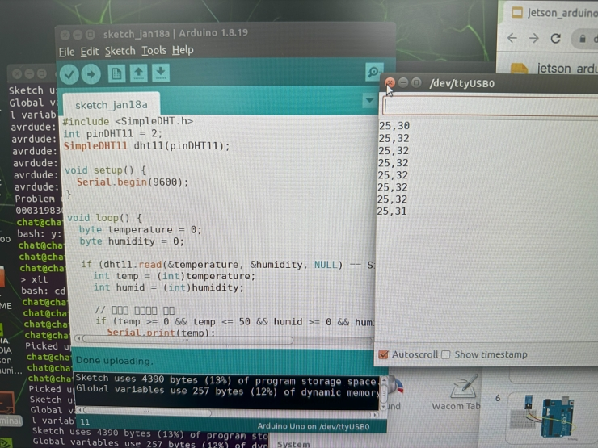

# 1️⃣ For Arduino. On Jetson Nano

1. arduino.cc   ->  버전 1.8.19
2. 젯슨나노에 아두이노 보드 연결
3. 센서 연결 -dht11 센서 연결. 

## ARM64용 Java를 설치

**1.시스템에서 패키지 목록 업데이트**

```sudo apt update```


**2.리눅스에서 OpenJDK 8 (Java Development Kit)을 설치하는 명령어***

```sudo apt install openjdk-8-jdk```


**3.Arduino 1.8.19 버전의 리눅스 ARM64(aarch64)용 설치 파일을 다운로드하는 명령어**

```wget https://downloads.arduino.cc/arduino-1.8.19-linuxaarch64.tar.xz```


**4. 다운로드한 Arduino 1.8.19 설치 파일(.tar.xz)을 압축 해제**

```tar -xf arduino-1.8.19-linuxaarch64.tar.xz```

---

**5. 아두이노 폴더**

```cd arduino-1.8.19```


**6. 아두이노 설치 명령실행**

```sudo ./install.sh```


**7.  사용 가능한 모든 TTY(터미널) 및 직렬 포트(Serial Port) 디바이스 목록을 출력**
  - ls → 파일 및 디렉토리 목록을 출력
  - /dev/tty* → /dev/ 디렉토리 내에서 tty로 시작하는 모든 파일 검색

```ls /dev/tty*```


**8. 리눅스에서 특정 직렬 포트 **(/dev/ttyACM0)** 에 대해 모든 사용자에게 읽기(r) 및 쓰기(w) 권한을 부여하는 명령어**

```sudo chmod a+rw /dev/ttyACM0  ```


**9. 아두이노 폴더 빠져나오기**

``cd ``


**10. 아두이노 실행**
    
```arduino```


**11. 아두이노가 실행되면 Tools 메뉴에서  board 와 port 설정을 한다.** 7번에서 권한설정을 했던 port를 찾아서 선택하고

  업로드가 잘되는지 빈 파일에서 업로드를 실행해본다.

  포트 설정이 잘못됐다면 맞는 것을 찾아 teminel에서 port권한설정을 해줘야 한다. 


port 설정이 완료되면 테스트 업로드를 해보고  잘된다면 아두이노와 젯슨을 연결한다.

**12. 아두이노 배선**


---

**13. 라이브러리 설치**


tools-LibraryManager 에서 온습도 센서 모델에 맞는 라이브러리를 설치한다. 

내가 사용한건 DHT11 의 저렴한 모듈이다. 

라이브러리 설치가 끝나면 File-example 에서 설치한 라이브러리(dht11) 의 예제를 열고 

배선된 핀번호 와 통신속도를 확인하고 알맞게 수정해준다. 

```
#include <SimpleDHT.h>
int pinDHT11 = 2;
SimpleDHT11 dht11(pinDHT11);

void setup() {
  Serial.begin(9600);
}

void loop() {
  byte temperature = 0;
  byte humidity = 0;
  
  if (dht11.read(&temperature, &humidity, NULL) == SimpleDHTErrSuccess) {
    int temp = (int)temperature;
    int humid = (int)humidity;
    
    // 유효한 범위인지 확인
    if (temp >= 0 && temp <= 50 && humid >= 0 && humid <= 100) {
      Serial.print(temp);
      Serial.print(",");
      Serial.println(humid);
    }
  }
  
  delay(2000);  // 2초 대기
}
```


나는 핀번호 2번과 통신속도 9600으로 설정했다. 

아두이노에 업로드가 완료되면 상단 오른쪽에 돋보기 모양버튼(시리얼 통신 모니터)을 눌러서 센서값을 확인한다.

아두이노에서 감지한 온습도 센싱값을 
sensor - arduino - jetson - python 을 거치면서 우리에게 전달 된다.

센서값을 불러올때는 숫자만 출력해야 한다 
```
Serial.print(temp);
Serial.print("*c ,");
Serial.println(humid);
```
에서 *c 같은 숫자가 아닌 데이터를 출력하면 오류가 난다



시리얼 모니터를 열고있으면 주피터와 충돌로 아두이노 값을 불러올수 없다

확인했으면 시리얼모니터를 닫아준다


[🙋‍♂️ next jupyter notebook](https://github.com/ralralra/jetson_DLI/blob/main/7_python%20and%20jupyter%20_venv.md)
[🙋‍♂️dht_chatbot_functioncalling](https://github.com/ralralra/jetson_DLI/blob/main/chatbot/3_dht_chatbot_functioncalling.ipynb)
