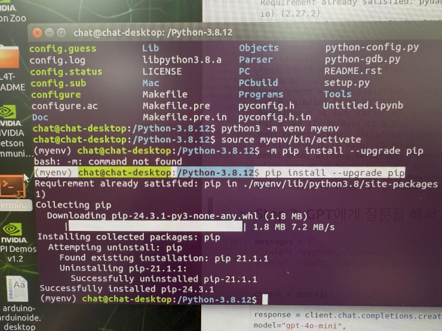

# python3 설치

```sudo apt upgrade```

**✅ python3.8 소스코드 받기**
```
cd /
sudo wget https://www.python.org/ftp/python/3.8.12/Python-3.8.12.tar.xz
```
**✅ 압축 풀기**
```
sudo tar -xf Python-3.8.12.tar.xz
cd Python-3.8.12
```


```
#./configure --enable-optimizations
./configure --enable-loadable-sqlite-extensions --with-bz2
```
```
pip3 install --upgrade pip

sudo apt-get install libbz2-dev
sudo apt-get install sqlite3 libsqlite3-dev

python3.8 -m pip install Jetson.GPIO 
```


**Python을 소스 코드에서 빌드하거나 일부 패키지를 컴파일할 때 필요한 필수 라이브러리와 개발 도구들을 설치**

**✅ 설치되는 주요 패키지들 설명**

- `build-essential`: C/C++ 컴파일러 및 필수 빌드 도구
- `libssl-dev`: OpenSSL 개발 라이브러리 (보안 관련)
- `libffi-dev`: 외부 함수 인터페이스 (Python 패키지 빌드 시 필요)
- `libsqlite3-dev`: SQLite 데이터베이스 개발 라이브러리
- `zlib1g-dev`: 압축 관련 라이브러리 (gzip 등)
-`tk-dev` : Tkinter GUI 라이브러리 개발용

```
sudo apt install -y build-essential libssl-dev libffi-dev \
    libgdbm-dev libnss3-dev libreadline-dev libsqlite3-dev \
    libbz2-dev liblzma-dev libncurses5-dev libncursesw5-dev \
    zlib1g-dev tk-dev
```

```
make -j4
sudo make altinstall
```

- 4개의 CPU 코어를 사용하여 병렬 방식으로 소스코드 컴파일실행
- `make altinstall`은 소스 코드로 빌드한 Python을 시스템에 설치

- make install을 실행하면 python 심볼릭 링크가 새 버전으로 바뀔 수 있음
- altinstall은 기본 Python 버전을 변경하지 않도록 보호한다.
  
---
# venv
venv는 **Python의 가상 환경 Virtual Environment**을 생성하는 도구이다.

Python 프로젝트마다 독립적인 패키지 환경을 유지할 수 있도록 해 줍니다

Python을 빌드하기 위해 필요한 라이브러리 및 개발 도구를 먼저 설치

python 3.3 이상부터 기본 내장되어 있어 별도 설치 과정은 없어도 된다.


## 가상환경 관련 명령어들 입니다

**가상환경 생성** :```python3 -m venv myenv```

**가상환경 활성화** : ```source myenv/bin/activate```

**활성화되면 프롬프트 앞에 (myenv)가 표시됨** : 예)```(myenv) user@computer:~$```

**가상환경 삭제** : 예) ```rm -rf venv #가상환경 이름 ```

---
**여기서부터는 가상환경입니다**

# 가상환경 만들고 실행


```
python3 -m venv myenv
source myenv/bin/activate
```

# 필요한 패키지들 설치


```
python -m pip install --upgrade pip
pip install jupyter gradio pandas ipykernel
pip install openai
pip install gradio

```


**✅ jetson GPIO**

Jetson 보드에서 GPIO 핀을 제어하기 위한 Python 라이브러리설치

```pip3 install Jetson.GPIO```


**✅가상환경을 Jupyter kernel로 등록합니다**

```
python -m ipykernel install --user --name=myenv --display-name="Python (myenv)"
jupyter notebook
```

**주피터 노트북에서 새파일을 만들때 `python(myenv)`** 가상환경에서 새파일을 만듭니다


